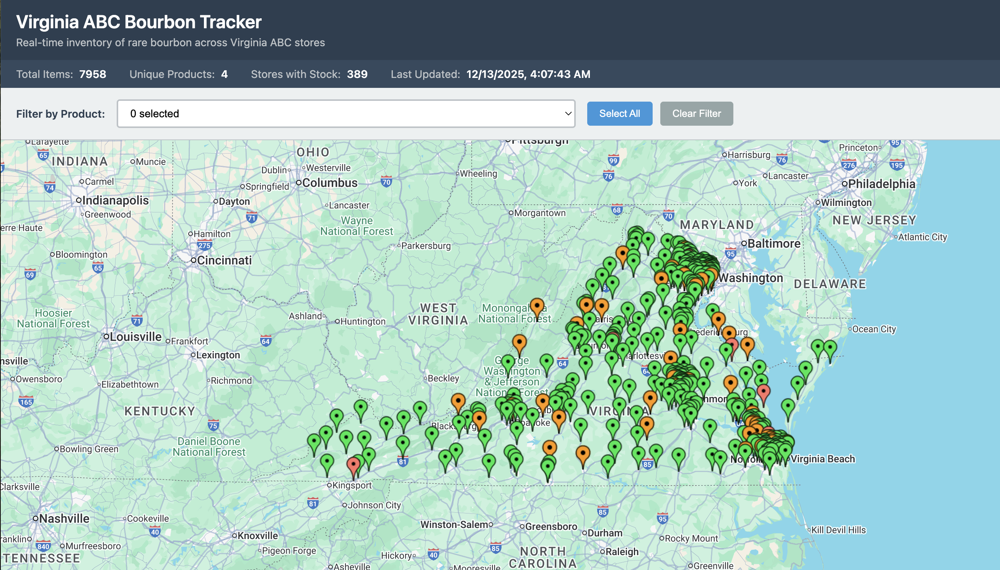
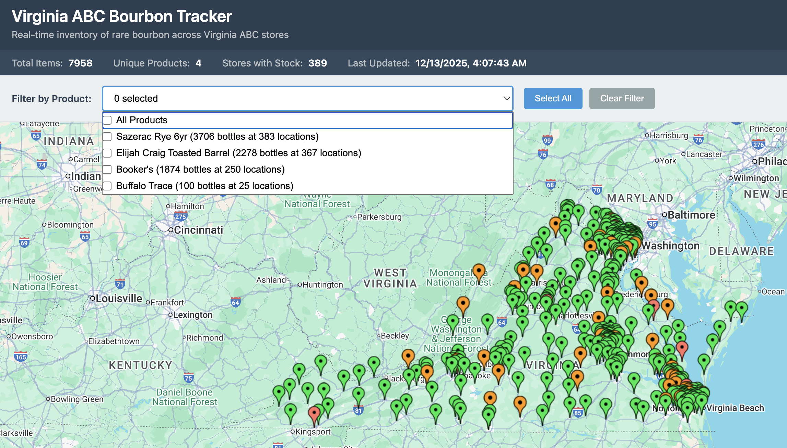
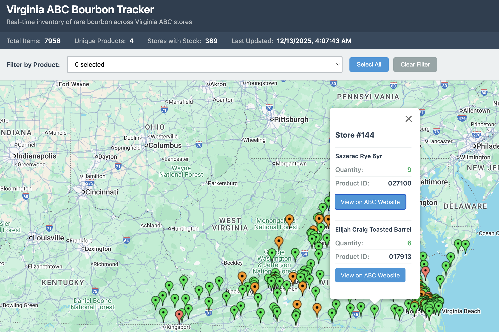
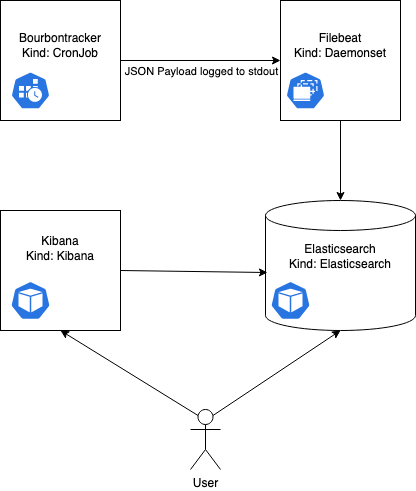

# Cask Watch

[](https://github.com/jeffspahr/bourbontracker/actions/workflows/main.yml)
[](https://github.com/jeffspahr/bourbontracker/releases)
[](https://github.com/jeffspahr/bourbontracker/pkgs/container/bourbontracker)
[](https://github.com/jeffspahr/bourbontracker/blob/main/go.mod)
[](https://github.com/jeffspahr/bourbontracker/blob/main/LICENSE)

Track rare bourbon and spirits availability across multiple states' ABC stores with real-time inventory monitoring and interactive map visualization.

## Features

- 🗺️ **Interactive Google Maps visualization** - See spirits inventory on a color-coded map
- 🌎 **Multi-state support** - Virginia ABC (390 stores) + Wake County NC (15 stores)
- 📊 **Tracked products** - Rare and allocated bourbons (Pappy, Blanton's, Buffalo Trace, E.H. Taylor, etc.)
- ⚡ **Real-time data** - Query live inventory via APIs and web scraping
- 🔒 **Secure** - API keys stored in gitignored config files
- 🐳 **Containerized** - Docker image with multi-arch support (amd64/arm64)
- 🔧 **Modular architecture** - Easy to add new states/counties

## Visualization Options

### Option 1: Google Maps (Simple, Recommended)

Interactive map showing spirits locations and quantities. Perfect for local use or simple deployments.

**Quick Start:**
```bash
# Copy config template and add your Google Maps API key
cp config.example.js config.js
# Edit config.js and add your API key

# Build the tracker
go build -o tracker ./cmd/tracker

# Run tracker to generate inventory data (Virginia ABC only)
./tracker

# Run with Wake County NC included
./tracker -va -wake

# Start local web server
python3 -m http.server 8000

# Open http://localhost:8000/map.html in your browser
```

See [MAP_USAGE.md](MAP_USAGE.md) for detailed setup instructions.

**Screenshots:**

<p align="center">
  
  <br/>
  <em>Interactive Google Maps view showing spirits inventory across Virginia ABC stores</em>
</p>

<p align="center">
  
  <br/>
  <em>Product filter dropdown with multi-select capability</em>
</p>

<p align="center">
  
  <br/>
  <em>Store marker showing product details and quantities</em>
</p>

### Option 2: Elasticsearch + Kibana (Advanced)

Full ELK stack deployment for historical data, time-series analysis, and alerting. Ideal for production Kubernetes environments.

The app outputs inventory data in JSON format which is picked up by Filebeat and shipped to an Elasticsearch cluster. End-to-end Kubernetes manifests are included in the `k8s/` directory.

See Architecture section below for details.

---

Inspired by https://github.com/misfitlabs/pappytracker

# Convert Product List from a Python Dictionary to JSON
```python3 dict2json.py |jq > products.json```
Tested on python3.

# Generate List of Stores
```go run generateStoreList.go```

# Run the Tracker

## Command Line Options
```bash
# Virginia ABC only (default)
./tracker

# Virginia ABC + Wake County NC
./tracker -va -wake

# Wake County NC only
./tracker -va=false -wake

# Custom output file
./tracker -output my-inventory.json

# Custom product list (for VA ABC)
./tracker -products my-products.json

# Custom store list (for VA ABC)
./tracker -stores my-stores
```

## Supported Regions

### Virginia ABC (`-va`)
- **Stores**: 390 across Virginia
- **Method**: REST API at `abc.virginia.gov`
- **Product IDs**: Numeric codes (e.g., `018006` for Buffalo Trace)
- **Coordinates**: Yes (latitude/longitude for each store)

### Wake County NC (`-wake`)
- **Stores**: 15 across Wake County
- **Method**: HTML parsing via web scraping
- **Product Search**: By name (e.g., "Buffalo Trace", "Blanton's")
- **Coordinates**: No (addresses only)

See [ARCHITECTURE.md](ARCHITECTURE.md) for details on adding new states/counties.

## Run using Docker
```bash
# Pull the latest version
docker pull ghcr.io/jeffspahr/bourbontracker:latest

# Run and save inventory.json to current directory
docker run --rm -v $(pwd):/root ghcr.io/jeffspahr/bourbontracker

# Or specify a version
docker pull ghcr.io/jeffspahr/bourbontracker:1.0.1
docker run --rm -v $(pwd):/root ghcr.io/jeffspahr/bourbontracker:1.0.1
```

**Note:** The `-v $(pwd):/root` flag mounts the current directory so `inventory.json` is written to your host machine for use with the Google Maps visualization.
# Architecture in Kubernetes
 
